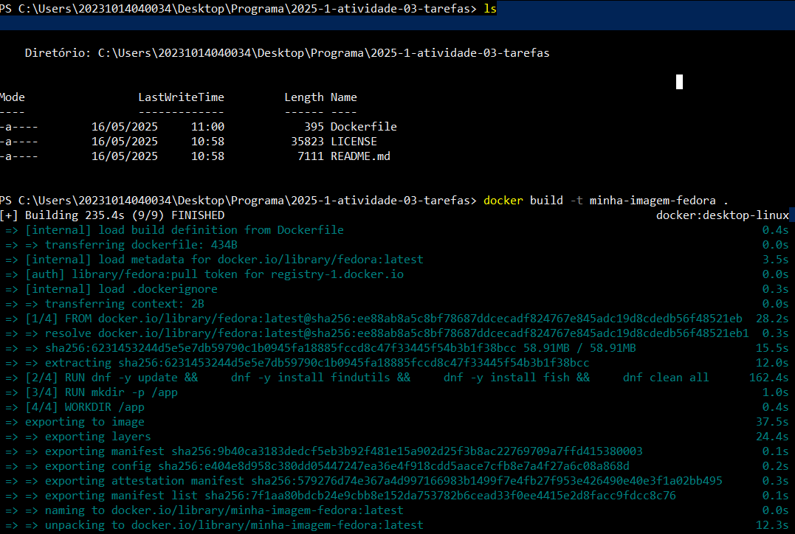
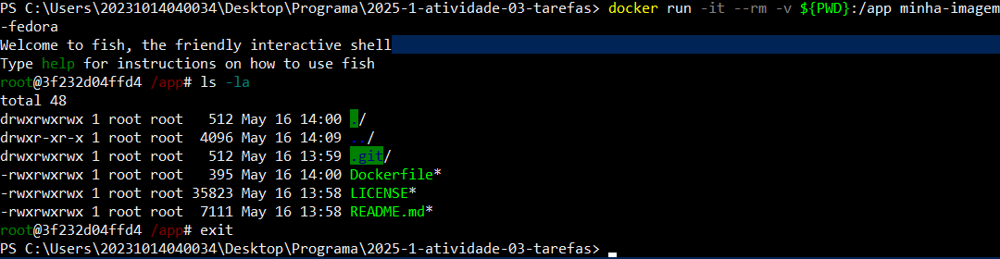
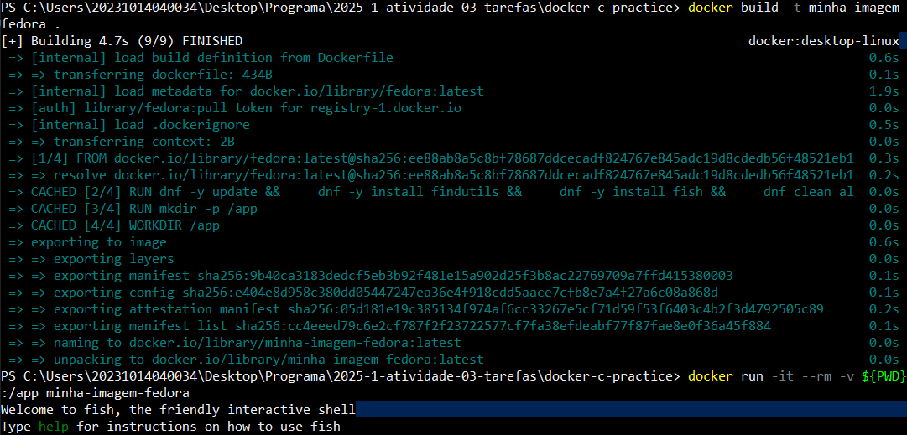
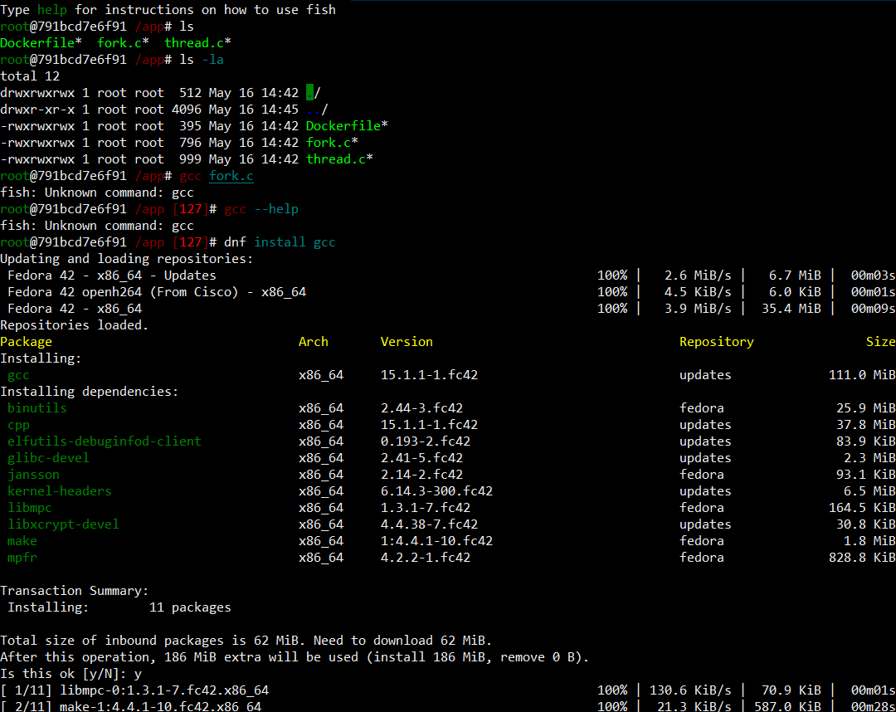
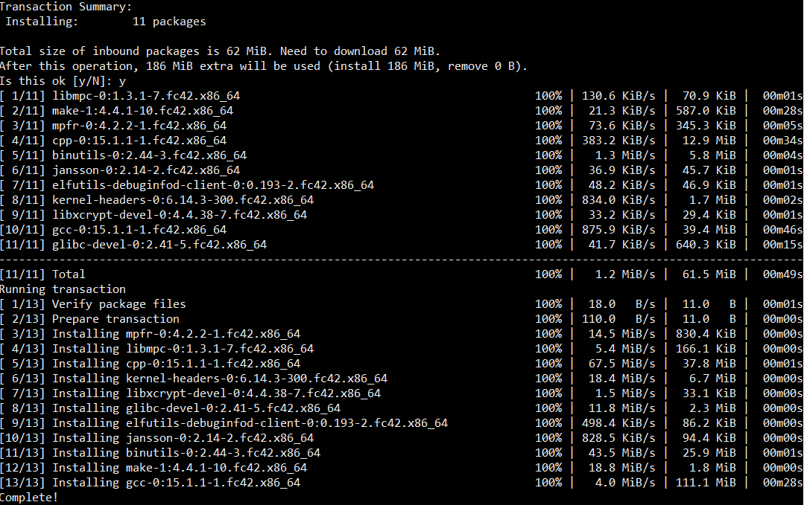
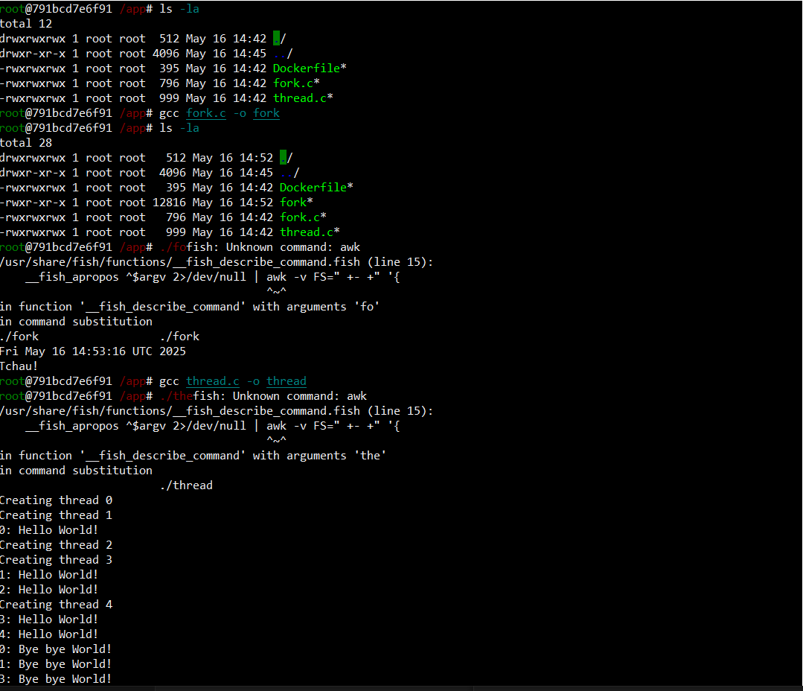
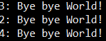

# 2025-1-atividade-03-tarefas

**Nome:** Wagner Alves de Souza  
**Data:** 13/06/2025

---

## Introdução

Neste exercício, o objetivo foi compreender e aplicar, na prática, os conceitos abordados em aula, por meio da manipulação de permissões, gerenciamento de diretórios e pacotes, encerramento de processos e navegação no sistema de arquivos Linux.
  
  

## Relato

### Gerando a imagem do container.

Listei os arquivos e gerei uma imagem Docker com meu arquivo de texto Dockerfile.  
`ls` -> listei os arquivos.  
`docker build -t minha-imagem-fedora .` -> Constroi uma imagem Docker a partir do documento Dockerfile no diretório atual com a tag `-t` que já nomeia a imagem.
  
  

---

### Executando o Container.

Executando o container com algumas flags.  
`docker run` -> Executa o container.  
`-it` -> Executa de forma interativa.  
`-rm` -> Remove o container após fechar.  
`-v ${PWD}:/app` -> Mapeia o volume do meu host para o container em `/app`, ou seja, tudo que boto nessa pasta já vem para o meu "computador".  
  
  

---

### Construindo a imagem e executando o container.

Refiz os dois passos anteriores, pois fiz na pasta errada... Agora os arquivos estão dentro da pasta docker-c-pratice.  
`ls` -> listei os arquivos.  
`docker build -t minha-imagem-fedora .` -> Constroi uma imagem Docker a partir do documento Dockerfile no diretório atual com a tag `-t` que já nomeia a imagem.  
`docker run` -> Executa o container.  
`-it` -> Executa de forma interativa.  
`-rm` -> Remove o container após fechar.    
`-v ${PWD}:/app` -> Mapeia o volume do meu host para o container em `/app`, ou seja, tudo que boto nessa pasta já vem para o meu "computador".  
  
  

---
### Baixando dependências e adicionando um programa.

Botei alguns arquivos dentro do container `fork.c` e `thread.c` e baixei o `gcc`.  
`ls` -> Listei os arquivos.  
`dnf install gcc` -> Comando para baixar o GCC.  
  
  

---
### Baixando algumas dependências.

Baixando e atualizando pacotes.  

  

---
### Compilando os arquivos txt para executável.

Compilei os arquivos de texto `fork.c` e `thread.c` para executável, a diferença entre a execução dos arquivos é que o `fork.c` ele cria uma cópia do processo pai, enquanto o `thread` dividiu o mesmo processo para uma execução mais eficaz.

  
  

---

### Final do resultado da execução.

  

---

## Conclusão

A parte mais difícil do trabalho foi compreender os códigos informados pelo professor.
